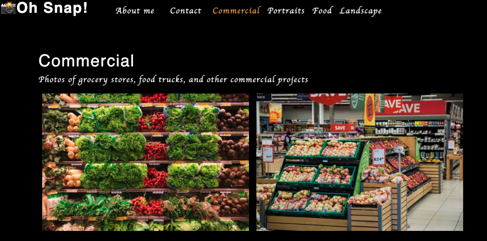

# photo-portfolio

A SPA for a photo portfolio using React.



|                                         |                                         |                                                   |
| :-------------------------------------: | :-------------------------------------: | :-----------------------------------------------: |
|    [Introduction](#photo-portfolio)     | [Table of Contents](#table-of-contents) | [Development Highlights](#development-highlights) |
|        [Deployment](#deployment)        |             [Tests](#tests)             |       [Code Hightlights](#code-highlights)        |
| [Technologies Used](#Technologies-Used) |           [Credits](#Credits)           |                [License](#License)                |

## Development Highlight

- Conditionally render components.
- Manage state between the parent and child components.
- Toggle the state of modal using hooks.
- Set up tests for React components.

## Installation

Deployed through GitHub Pages.

[Deployment](https://anusontarangkul.github.io/photo-portfolio/)

## Tests

```
npm run test
```

## Code Highlights

Use react hooks to update the state of the form.

```JavaScript
    const [formState, setFormState] = useState({ name: '', email: '', message: '' });

    const [errorMessage, setErrorMessage] = useState('');
    const { name, email, message } = formState;

    const handleSubmit = (e) => {
        e.preventDefault();
        if (!errorMessage) {
            console.log('Submit Form', formState);
        }
    };

    const handleChange = (e) => {
        if (e.target.name === 'email') {
            const isValid = validateEmail(e.target.value);
            if (!isValid) {
                setErrorMessage('Your email is invalid.');
            } else {
                setErrorMessage('');
            }
        } else {
            if (!e.target.value.length) {
                setErrorMessage(`${e.target.name} is required.`);
            } else {
                setErrorMessage('');
            }
        }
        if (!errorMessage) {
            setFormState({ ...formState, [e.target.name]: e.target.value });
            console.log('Handle Form', formState);
        }
    };
```

Mapping through the categories to create the lists of them and set onClick function.

```JavaScript
    {categories.map((category) => (
        <li className={`mx-1 ${
            currentCategory.name === category.name && !contactSelected && 'navActive'
                }`} key={category.name}>
                    <span
                        onClick={() => {
                            setCurrentCategory(category)
                            setContactSelected(false);
                            }
                        >
```

## Technologies-Used

### Frontend

- [HTML](https://www.w3schools.com/html/)
- [JavaScript](https://www.javascript.com/)
- [CSS](https://www.w3schools.com/css/)

### Frontend Framework/Library

- [ReactJS](https://reactjs.org/)

### Test

- [Jest](https://jestjs.io/docs/tutorial-react)

## Credits

|                           |                                                                                                                                                                                                       |
| ------------------------- | ----------------------------------------------------------------------------------------------------------------------------------------------------------------------------------------------------- |
| **David Anusontarangkul** | [ LinkedIn](https://www.linkedin.com/in/anusontarangkul/) [ GitHub](https://github.com/anusontarangkul) |

## License

[](https://opensource.org/licenses/MIT)
